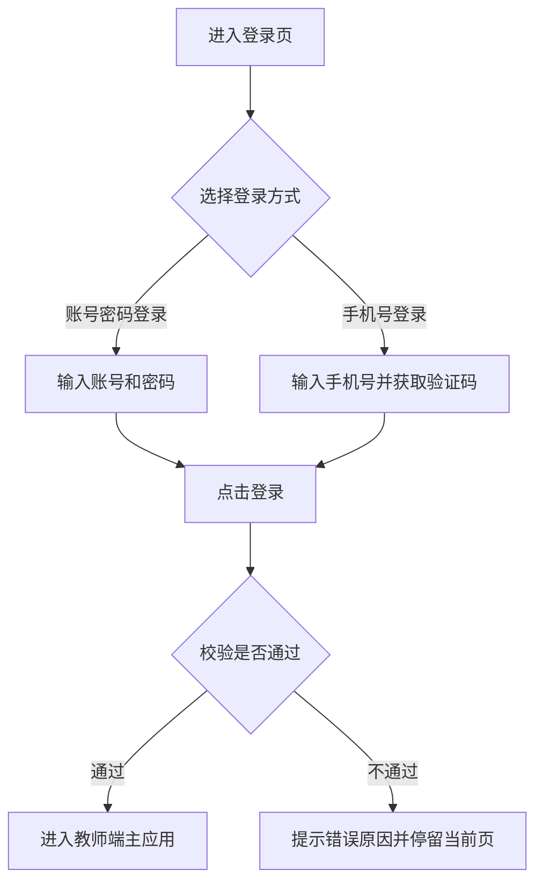
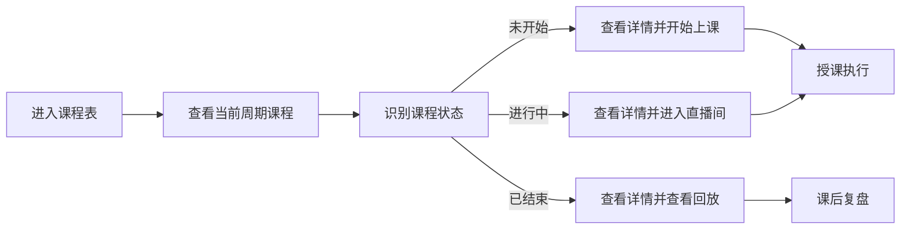
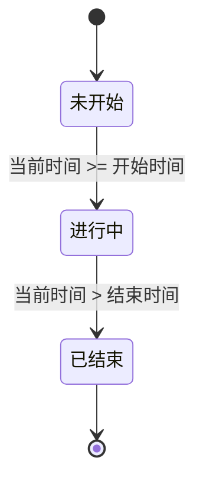

# 教师端功能逻辑说明

基于 `/Volumes/AI_Agent/github/xunyi/教师web端.html` 当前界面与交互梳理，以下内容从专业产品经理视角输出教师端的详细功能逻辑说明。文档不仅覆盖原型中已经展示的页面元素和操作路径，也补充了实际业务中必须存在、但原型图中未完全展开的隐含逻辑、状态规则、异常处理和边界约束，可作为后续 PRD 细化基础稿。

## 一、文档结论

**当前教师端原型的核心定位非常明确：以“教师执行教学任务”为中心，围绕课程履约、学员跟进、学情判断和个人资料维护形成一个轻量工作台。**

从原型可判断，教师端并不是一个“全流程管理后台”，而是一个“授课执行端”：

1. 教师的第一工作入口是课程表，而不是数据报表。
2. 产品希望把教师高频动作压缩到最短链路，尤其是“看课-点课-开始上课/进入直播间/查看回放”。
3. 学员管理与学情数据承担辅助决策作用，帮助教师做课后跟进和风险识别。
4. 教师端以查看、操作、反馈为主，不承载排课、调课、基础数据维护等强运营动作。

## 二、产品定位与用户场景

### 2.1 产品定位

教师端面向围棋培训机构教师使用，核心价值是帮助教师在一个统一界面内完成以下工作：

1. 快速登录并进入当天教学状态。
2. 查看个人授课安排并识别当前课程状态。
3. 进入课前、课中、课后的关键教学动作。
4. 查看学员名单、学习表现及重点关注对象。
5. 查看班级整体学习数据和风险预警。
6. 维护个人资料、密码和个人教学统计。

### 2.2 典型使用场景

1. **开课前 10 分钟**
   - 教师打开教师端，查看今天/本周课程，点击即将开始的课程，预览课件并进入上课准备状态。

2. **上课进行中**
   - 教师从课程表中快速识别“进行中”课程，直接进入直播间或授课控制台，避免多层跳转。

3. **课后复盘**
   - 教师查看已结束课程的回放入口，结合课堂表现和学员数据进行复盘。

4. **课后跟进学员**
   - 教师进入学员管理，筛选班级，查看低出勤、低预习、低作业完成率学员，并结合档案判断是否需要联系家长。

5. **阶段性教学观察**
   - 教师在学情数据页面查看班级平均指标、趋势变化和预警列表，快速发现班级下滑和风险学生。

## 三、功能架构总览

### 3.1 一级功能模块

当前原型实际呈现以下一级模块：

1. 登录
2. 课程表
3. 学员管理
4. 学情数据
5. 个人中心

### 3.2 全局公共能力

1. 顶部品牌区与版本识别
2. 顶部消息提醒及未读数展示
3. 当前登录教师身份展示
4. 左侧导航切换
5. 课程详情弹窗
6. 学员档案弹窗
7. 页面内筛选与视图切换
8. 退出登录

### 3.3 模块与业务价值对应表

| 模块 | 核心入口 | 主要价值 | 教师高频动作 |
| --- | --- | --- | --- |
| 登录 | 登录页 | 快速进入工作台 | 登录、切换登录方式 |
| 课程表 | 默认首页 | 承接教师最核心授课任务 | 看课、点课、开课、进直播、看回放、看课件 |
| 学员管理 | 左侧导航 | 识别个体学习情况 | 搜索学员、按班筛选、查看档案 |
| 学情数据 | 左侧导航 | 识别班级整体表现和风险 | 看指标、看趋势、看预警 |
| 个人中心 | 左侧导航 | 维护个人信息与账号安全 | 改资料、改密码、看教学统计 |

## 四、全局框架与通用交互

### 4.1 顶部框架

顶部区域包含品牌标识、系统名称、版本号、消息提醒、教师身份和退出入口。

其业务意义如下：

1. 品牌区用于建立教师对当前系统的身份认知，避免多系统切换时混淆。
2. 版本号用于承接灰度发布、问题排查和版本感知。
3. 消息提醒用于承接课程提醒、系统通知、调课通知、待办消息等。
4. 教师身份展示用于确认当前登录账号，尤其适用于多老师共用电脑或机构前台协助登录场景。
5. 退出入口用于主动结束会话，保证账号安全。

### 4.2 左侧导航

左侧导航用于在四个业务模块间切换：

1. 课程表
2. 学员管理
3. 学情数据
4. 个人中心

交互逻辑：

1. 当前模块高亮显示。
2. 点击其他模块后，仅切换右侧内容区，不刷新整个应用框架。
3. 导航切换应保留当前登录态。
4. 若某页面存在未保存内容，系统应在切换前给予提示。

### 4.3 通用弹窗逻辑

当前原型包含课程详情弹窗和学员档案弹窗。

通用规则建议如下：

1. 点击触发源打开弹窗。
2. 支持点击右上角关闭按钮关闭。
3. 支持点击遮罩关闭。
4. 建议支持 `ESC` 关闭，补齐键盘交互。
5. 弹窗打开后，背景页禁止误触滚动。
6. 关闭后保留原页面上下文位置，避免教师重新定位。

### 4.4 权限边界

从原型可推断教师端权限以“查看 + 执行动作”为主，原则上不包含以下高风险维护能力：

1. 不直接新增课程。
2. 不直接编辑排课。
3. 不直接变更学员基础档案。
4. 不直接修改班级结构。
5. 不直接修改学情统计口径。

**这意味着教师端更像“业务执行端”，而非“机构运营管理端”。**

## 五、登录

### 5.1 功能目标

支持教师以熟悉且低门槛的方式进入系统，尽快进入授课状态。

### 5.2 页面组成

登录页包含以下元素：

1. 系统 Logo 与产品名称
2. 版本号展示
3. 账号密码登录 Tab
4. 手机号验证码登录 Tab
5. 账号输入框
6. 密码输入框
7. 手机号输入框
8. 验证码输入框
9. 获取验证码按钮
10. 记住密码复选框
11. 忘记密码入口
12. 登录按钮

### 5.3 核心流程

### 5.4 功能逻辑说明

#### 5.4.1 账号密码登录

1. 教师输入账号和密码后点击登录。
2. 账号可支持手机号、工号、用户名等机构统一账号体系。
3. 密码输入框需默认密文显示。
4. 若勾选“记住密码”，则在本机下次打开时自动回填。
5. 登录成功后进入教师端主应用，默认落在课程表页面。

#### 5.4.2 手机号验证码登录

1. 教师输入手机号后点击“获取验证码”。
2. 系统校验手机号格式正确后发送验证码。
3. 验证码输入正确后可完成登录。
4. 适用于弱密码场景、临时登录场景或密码遗忘后的快捷登录场景。

#### 5.4.3 登录方式切换

1. 支持在账号密码登录和手机号登录之间切换。
2. 切换时不应误清空当前页未提交信息，除非出于安全策略必须清空。
3. 建议分别缓存两个 Tab 的输入态，减少重复输入。

### 5.5 业务规则

| 规则项 | 说明 |
| --- | --- |
| 账号必填 | 账号密码登录下账号不能为空 |
| 密码必填 | 账号密码登录下密码不能为空 |
| 手机号格式 | 必须符合中国大陆手机号格式 |
| 验证码时效 | 建议 5 分钟内有效 |
| 验证码频控 | 建议 60 秒内不可重复获取，单日次数受限 |
| 登录成功跳转 | 默认进入课程表页 |
| 登录态保持 | 在有效期内可免重复登录 |

### 5.6 隐含逻辑补充

1. “记住密码”更适用于账号密码登录，在手机号验证码登录场景下建议改为“记住手机号”，避免概念混淆。
2. 若教师存在多个校区或多个身份，登录后应先确认默认授课身份，再进入课程表。
3. 若账号已在其他设备登录，可根据机构安全策略决定是否允许并行登录。
4. 若教师长时间未操作，系统应自动失效登录态并跳回登录页。

### 5.7 异常场景

1. 账号不存在。
2. 密码错误。
3. 手机号未绑定教师账号。
4. 验证码错误、过期或已失效。
5. 登录接口超时。
6. 账号被禁用或离职停用。
7. 网络异常导致无法登录。

## 六、课程表

### 6.1 功能目标

课程表是教师端的默认首页，也是教师最核心的工作入口。其目标是帮助教师按时间维度快速理解个人授课安排，并在课前、课中、课后进入对应动作。

### 6.2 页面组成

当前原型课程表页面包含：

1. 本周 / 本月视图切换
2. 上一周期 / 下一周期切换
3. 当前日期区间展示
4. 课程状态图例
5. 以周为列、时间为行的课程时间格
6. 课程卡片
7. 课程详情弹窗

### 6.3 教师核心使用链路

### 6.4 视图切换逻辑

#### 6.4.1 本周 / 本月切换

1. 支持“本周”和“本月”两种视图。
2. 本周视图用于承接高频授课排期查看，是教师日常使用主视图。
3. 本月视图用于查看全月排班密度、周末排课分布、密集期工作量等。
4. 切换后应同步刷新日期区间文本与课程数据。
5. 系统应记忆教师上一次使用的视图，下次进入课程表默认展示该视图。

#### 6.4.2 日期导航

1. 左右箭头用于切换周期。
2. 本周视图按周切换，本月视图按月切换。
3. 当前日期文本应作为当前查看周期的唯一说明信息。
4. 建议补充“今天”快捷入口，否则教师从远期周期回到当周路径较长。

### 6.5 时间格展示逻辑

#### 6.5.1 时间轴结构

1. 横向为星期维度，纵向为小时维度。
2. 原型展示时间段为 `08:00-20:00`。
3. 无课程时段为空白，避免视觉噪音。
4. 时间轴应保证课程时间和空间位置一一对应，减少教师误判。

#### 6.5.2 课程块展示

每个课程块至少展示两项核心信息：

1. 班级名称
2. 课程名称 + 教室/授课方式

示例：

- `启蒙A班 / 围棋基础 · 1教室`
- `1v1辅导 / 布局训练 · 线上`

#### 6.5.3 课程块可视规则

1. 班级名称优先展示，保证教师先识别授课对象。
2. 第二行用于展示课程主题和教室。
3. 信息过长时应截断并显示省略号，避免卡片撑破布局。
4. 课程时长应映射到卡片高度，1 小时课程占 1 个标准时间格。
5. 若出现 1.5 小时或 2 小时课程，应纵向拉伸卡片高度。

#### 6.5.4 多课程冲突与并发展示

这是原型中未展开但业务上必须考虑的隐含逻辑：

1. 同一教师同一时间原则上不应出现两节课，若出现说明排课冲突。
2. 若排课冲突存在，页面应以并排压缩卡片或冲突标识提示，而不是简单覆盖。
3. 若同一时段存在“线下课 + 线上陪练”等特殊并发安排，应在课程类型上明确区分。

### 6.6 课程状态逻辑

原型通过颜色直接区分三类课程状态：

1. 未开始：蓝色
2. 进行中：红色
3. 已结束：灰色

#### 6.6.1 状态判定规则

具体业务规则：

| 状态 | 判定条件 | 教师主要动作 |
| --- | --- | --- |
| 未开始 | 当前时间 < 课程开始时间 | 查看详情、预览课件、开始上课 |
| 进行中 | 开始时间 <= 当前时间 <= 结束时间 | 进入直播间、继续授课 |
| 已结束 | 当前时间 > 课程结束时间 | 查看回放、课后复盘 |

#### 6.6.2 补充规则

1. 若教师提前点击“开始上课”，系统可记录实际开课时间，但课程主状态仍建议按预设课表时间判定。
2. 若支持延时下课或提前下课，应在直播/授课控制台记录实际结束时间，并影响回放时长和课时统计。
3. 跨时区场景较少，但如果存在异地线上授课，应以教师执行时区或机构统一时区为准，不能因浏览器本地时间导致误判。

### 6.7 课程详情弹窗

#### 6.7.1 展示字段

当前原型课程详情弹窗包含：

1. 班级
2. 课程
3. 时间
4. 教室
5. 类型
6. 学员数
7. 课件
8. 动作区按钮

#### 6.7.2 字段逻辑定义

| 字段 | 含义 | 说明 |
| --- | --- | --- |
| 班级 | 当前课程所属班级 | 教师首先确认授课对象 |
| 课程 | 当前节次名称/课题名称 | 用于识别本节内容 |
| 时间 | 起止时间 | 应包含日期和时段，避免跨天误解 |
| 教室 | 线下教室或线上标识 | 可承接“1教室/线上”等信息 |
| 类型 | 大班课/小班课/1v1 | 决定授课组织方式 |
| 学员数 | 本节应到学员数 | 有利于教师预判课堂组织难度 |
| 课件 | 当前课程绑定课件 | 支持快速查看 |

#### 6.7.3 关闭方式

当前原型已支持：

1. 右上角关闭按钮关闭
2. 点击遮罩关闭

建议补充：

1. `ESC` 键关闭
2. 保持弹窗关闭后焦点回到上一个课程块

### 6.8 不同课程状态下的动作

#### 6.8.1 未开始课程

弹窗动作：

1. 开始上课
2. 查看课件

业务逻辑：

1. “开始上课”是课前关键主动作，应高亮显示。
2. 点击后跳转直播授课页或授课控制台。
3. 开课动作可同步记录教师实际进入授课环节的时间。
4. 若距离开课时间过早，系统可二次确认，避免误开课。

#### 6.8.2 进行中课程

弹窗动作：

1. 进入直播间
2. 查看课件

业务逻辑：

1. “进入直播间”用于已开课后的继续授课或断线重进。
2. 同一课程在进行中阶段，教师应可重复进入。
3. 若课程已进入结束缓冲期但教师仍未退出，可提示课程即将结束。

#### 6.8.3 已结束课程

弹窗动作：

1. 查看回放
2. 查看课件

业务逻辑：

1. 已结束课程不再允许直接进入授课态。
2. 查看回放用于教师复盘，不应改变课程状态。
3. 课件在课后仍应可查看，方便教师回顾本节使用内容。

### 6.9 课程表中的隐含业务逻辑

#### 6.9.1 课程数据来源

教师端课程通常来源于机构统一排课系统，因此建议明确：

1. 教师端默认只读展示课表。
2. 教师不能直接在教师端新增、删除、改时间。
3. 若发生调课、代课、教室调整，应由运营端同步变更结果。

#### 6.9.2 开课提醒

尽管原型未展示消息详情，但从顶部消息铃铛可合理补充：

1. 开课前 15 分钟推送提醒。
2. 提醒内容应包含班级、课程名称、开始时间。
3. 点击消息可直接跳转到对应课程详情或课程表当天位置。

#### 6.9.3 课程变更通知

1. 课程时间变更。
2. 教室变更。
3. 授课教师变更。
4. 停课或取消。

这些通知都应进入顶部消息中心，并保留未读标识。

#### 6.9.4 离线与数据刷新

1. 若网络异常，页面应保留最近一次成功加载的课表快照。
2. 系统应给出“当前显示为缓存数据”的提示。
3. 网络恢复后自动刷新当前周期数据。

### 6.10 异常与边界处理

1. 当前周期无课程时，展示空状态而非空白表格。
2. 课程无课件时，“查看课件”按钮应置灰或点击后明确提示。
3. 课程已取消时，不应按普通已结束课程处理，应单独标记“已取消”。
4. 教师点击“开始上课”但直播页打开失败时，应保留当前课程详情并提示重试。
5. 进行中课程若直播中断，应支持重新进入，不应误判为已结束。

## 七、学员管理

### 7.1 功能目标

帮助教师快速找到具体学员，查看其当前学习状态，并为个性化教学、家校沟通和后续跟进提供依据。

### 7.2 页面组成

当前原型学员管理页面包含：

1. 学员姓名搜索框
2. 班级筛选下拉
3. 学员列表表格
4. 学员档案弹窗能力

### 7.3 列表字段说明

| 字段 | 业务含义 | 教师使用价值 |
| --- | --- | --- |
| 姓名 | 学员姓名 | 快速识别目标学生 |
| 年龄 | 学员年龄 | 辅助判断认知阶段和沟通方式 |
| 等级 | 围棋等级/级位 | 判断当前学习水平 |
| 出勤率 | 到课表现 | 判断稳定性和学习连续性 |
| 预习完成率 | 课前准备情况 | 判断学习主动性 |
| 作业完成率 | 课后落实情况 | 判断巩固效果 |

### 7.4 核心功能逻辑

#### 7.4.1 学员搜索

1. 支持按姓名搜索。
2. 建议支持模糊匹配，而不仅是完全匹配。
3. 搜索结果应基于当前班级筛选条件联动。
4. 无结果时需要给出空状态提示。

#### 7.4.2 按班级筛选

1. 教师可查看全部班级或单个班级。
2. 筛选后列表数据实时刷新。
3. 筛选条件切换后，建议保留当前搜索词，便于“班级内找人”。

#### 7.4.3 学员列表查看

1. 列表应优先呈现教师最关心的学习过程指标，而不是冗余基础信息。
2. 教师通过扫表即可识别重点学员。
3. 对低于阈值的指标，建议后续用颜色或图标增强提示。

### 7.5 学员档案弹窗

尽管当前列表中未直接展示“查看档案”按钮，但原型已存在学员档案弹窗结构，因此业务上应视为已具备学员档案查看能力。

#### 7.5.1 档案字段

当前原型学员档案包含：

1. 头像/默认头像
2. 姓名
3. 年龄
4. 班级
5. 校区
6. 等级标签
7. 学习积极度标签
8. 薄弱点标签
9. 家长联系方式
10. 入学时间
11. 累计课时
12. 出勤率
13. 预习完成率
14. 学习进度趋势图

#### 7.5.2 档案使用价值

1. 帮助教师快速建立对单个学员的整体认知。
2. 支持课前回忆该学员的特点和薄弱点。
3. 支持课后与家长沟通时引用事实数据。
4. 支持对长期趋势而非单次表现做判断。

### 7.6 隐含逻辑补充

1. 学员档案建议支持从列表行点击进入，或补充“查看档案”按钮。
2. 家长手机号应脱敏展示，防止信息泄露。
3. 学习积极度、薄弱点等标签不应由教师随意自由输入，建议来源于规则引擎或统一标签库。
4. 趋势图应支持最少近 4 周或近 8 周维度，否则趋势意义不足。
5. 若学员已转班、休学或退费，档案中应展示当前学习状态，避免教师误跟进。

### 7.7 异常与边界处理

1. 班级下无学员时展示空状态。
2. 学员基础信息缺失时应显示“未完善”，而不是留空白。
3. 已停课学员若仍保留在列表中，需要有明显状态标识。
4. 同名学员搜索时建议展示班级或校区辅助区分。

## 八、学情数据

### 8.1 功能目标

帮助教师从“班级整体视角”理解教学效果，而不是停留在单个学员观察层面。

### 8.2 页面组成

当前原型学情数据页面包含：

1. 班级筛选
2. 时间范围筛选
3. 四个核心指标卡片
4. 班级成绩趋势图区域
5. 学员排名图区域
6. 预警提醒列表

### 8.3 核心指标说明

| 指标 | 含义 | 业务价值 |
| --- | --- | --- |
| 平均出勤率 | 班级内学员到课情况平均值 | 判断班级稳定性 |
| 平均预习完成率 | 班级课前准备平均值 | 判断学习主动性 |
| 平均答题正确率 | 课堂答题表现平均值 | 判断知识吸收效果 |
| 平均课后完成率 | 作业/课后任务落实平均值 | 判断学习闭环情况 |

### 8.4 筛选逻辑

#### 8.4.1 班级筛选

1. 支持查看全部班级或指定班级。
2. 当选择指定班级时，所有指标、趋势和预警应同步按该班级过滤。

#### 8.4.2 时间范围筛选

当前原型展示：

1. 最近 30 天
2. 最近 7 天
3. 本学期

业务逻辑：

1. 时间范围切换后，所有指标需要统一按同一口径重算。
2. 趋势图横轴粒度应随时间范围变化。
3. 本学期口径应由机构学期配置决定，而不是自然季度。

### 8.5 趋势与排名

#### 8.5.1 班级成绩趋势

1. 用于观察班级整体表现是在提升、波动还是下滑。
2. 不建议只看单个数值，趋势变化更能支持教师判断教学是否有效。
3. 建议支持查看具体时间点明细值。

#### 8.5.2 学员排名

1. 用于识别班级头部学员和相对落后学员。
2. 排名不应只使用单一指标，建议采用综合学习指数。
3. 若直接显示排名，应注意避免对教师形成“只关注头部”的误导，建议同时突出进步较快和风险较高学生。

### 8.6 预警提醒

当前原型已体现四类典型预警：

1. 连续缺课
2. 成绩明显下滑
3. 预习完成率长期偏低
4. 请假后长期未复课

#### 8.6.1 预警的业务价值

1. 帮助教师快速识别风险学员。
2. 为联系家长、调整授课策略、重点关注提供抓手。
3. 避免教师只靠经验判断，提升跟进标准化程度。

#### 8.6.2 预警规则建议

| 预警类型 | 建议触发逻辑 | 建议优先级 |
| --- | --- | --- |
| 连续缺课 | 连续 3 次未到课 | 高 |
| 成绩下滑 | 最近 2 周正确率下降超过阈值 | 中 |
| 预习偏低 | 连续 4 周预习完成率低于阈值 | 中 |
| 长期未复课 | 请假/停课后超过设定天数未恢复 | 高 |

#### 8.6.3 预警闭环

原型当前只展示“提醒”，但真实业务需要闭环：

1. 预警产生。
2. 教师查看预警。
3. 教师采取动作，如联系家长、课后单独辅导、标记已关注。
4. 系统记录处理结果。
5. 后续若问题消失，则预警自动消除或转为已处理。

### 8.7 隐含逻辑补充

1. 所有学情指标都必须有统一口径，否则教师无法信任数据。
2. 如果某班级样本量极小，系统应提示“样本不足，仅供参考”。
3. 对新入学学员，应避免因样本期过短而触发误预警。
4. 图表区域当前是占位，正式版应支持点击查看明细或联动至学员列表。

## 九、个人中心

### 9.1 功能目标

支持教师维护个人资料和账号安全信息，同时查看个人阶段性教学产出。

### 9.2 页面组成

当前原型个人中心包含三部分：

1. 个人资料
2. 修改密码
3. 教学统计

### 9.3 个人资料

#### 9.3.1 可见字段

1. 头像
2. 姓名
3. 围棋段位
4. 手机号
5. 个人简介
6. 保存修改按钮

#### 9.3.2 功能逻辑

1. 教师可修改个人对外展示资料。
2. 头像用于提升个人识别度和机构形象一致性。
3. 围棋段位和简介会影响教师专业形象展示，应控制填写规范。
4. 保存后应即时提示成功或失败结果。

#### 9.3.3 字段规则建议

| 字段 | 是否可编辑 | 规则建议 |
| --- | --- | --- |
| 头像 | 是 | 支持图片格式和大小限制 |
| 姓名 | 谨慎 | 若涉及合同和排课，建议需审核 |
| 围棋段位 | 谨慎 | 建议可编辑但需管理员审核 |
| 手机号 | 是 | 修改时建议二次验证 |
| 个人简介 | 是 | 限制字数并过滤敏感词 |

### 9.4 修改密码

#### 9.4.1 页面字段

1. 当前密码
2. 新密码
3. 确认新密码
4. 确认修改按钮

#### 9.4.2 业务逻辑

1. 当前密码必须校验正确。
2. 新密码和确认新密码必须一致。
3. 新密码应满足长度、复杂度和安全规则。
4. 修改成功后，建议要求教师重新登录，避免旧登录态继续有效。

#### 9.4.3 异常场景

1. 当前密码错误。
2. 新旧密码一致。
3. 两次输入不一致。
4. 新密码不符合复杂度要求。
5. 修改接口失败。

### 9.5 教学统计

当前原型展示：

1. 本月课时数
2. 学员评价
3. 月度课时趋势图

其业务意义：

1. 让教师了解自身工作量。
2. 让教师感知服务反馈而不仅是排课数量。
3. 帮助教师回看月内授课波动，辅助排班与绩效沟通。

### 9.6 隐含逻辑补充

1. 教学统计口径需明确是否按已上课时、排课课时或结算课时统计。
2. 学员评价需说明评分来源，是课后打分、阶段问卷还是家长满意度。
3. 若教师存在多个校区授课，应支持聚合统计和分校区查看。

## 十、消息提醒

虽然当前原型仅展示了顶部铃铛和未读数，但从实际业务上，消息提醒应至少覆盖以下内容：

1. 课程即将开始提醒
2. 调课/停课/换教室通知
3. 授课教师变更通知
4. 学员请假或复课通知
5. 系统公告
6. 待处理风险提醒

建议消息中心具备以下逻辑：

1. 区分未读和已读。
2. 支持点击跳转到对应业务页面。
3. 对高优先级消息保留醒目提示。
4. 重要通知需支持多次提醒或置顶。

## 十一、数据口径与业务规则建议

### 11.1 学习指标口径建议

| 指标 | 建议定义 |
| --- | --- |
| 出勤率 | 实到课次数 / 应到课次数 |
| 预习完成率 | 已完成预习人数或次数 / 应完成预习人数或次数 |
| 作业完成率 | 已完成课后任务人数或次数 / 应完成课后任务人数或次数 |
| 答题正确率 | 正确题数 / 总答题数 |

### 11.2 课程字段最小闭环

正式 PRD 中建议明确以下课程基础字段：

1. 课程 ID
2. 班级 ID
3. 课程名称
4. 节次名称
5. 开始时间
6. 结束时间
7. 授课方式
8. 授课教室
9. 课程类型
10. 绑定课件
11. 应到学员数
12. 课程状态

## 十二、当前原型已体现的重点与不足

### 12.1 已体现的重点

1. **课程表是教师主工作入口**，产品方向正确。
2. **操作链路很短**，符合教师高频使用习惯。
3. **学情看板和学员管理分层清晰**，一个看整体，一个看个体。
4. **课程详情弹窗承接动作明确**，有利于课前课中课后的状态分流。

### 12.2 当前原型尚未展开但建议后续补齐的内容

1. 登录校验与账号安全策略。
2. 消息中心详情页和消息分类。
3. 课程取消、调课、冲突等异常状态展示。
4. 学员档案的正式入口与更多长期学习数据。
5. 学情预警的处理闭环，而非只提醒不处理。
6. 个人资料字段的编辑权限和审核机制。
7. 图表的实际交互能力与指标明细查看。

## 十三、结语

**从当前原型判断，教师端已经具备较清晰的核心骨架，下一步最关键的不是继续堆页面，而是把“状态规则、指标口径、异常流程、权限边界、消息闭环”补完整。**

如果后续要进入正式 PRD 阶段，建议优先细化以下三块：

1. 课程状态与授课动作闭环。
2. 学情指标口径与预警触发规则。
3. 教师个人资料、账号安全与消息通知规则。

以上内容可直接作为教师端需求评审、原型说明和后续 PRD 拆解的基础版本。
